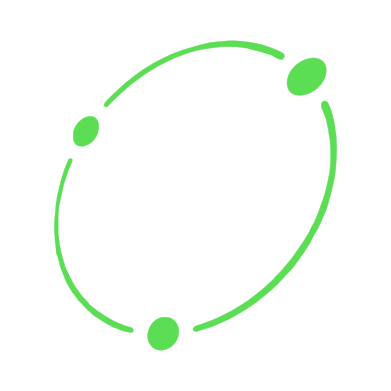

# - ConnectEd -

 

  | &nbsp &nbsp &nbsp Kyle Smith &nbsp &nbsp &nbsp |

 
 

 
 
 

[<kbd>   DOWNLOAD .EXE   </kbd>][KBD]

 

[<kbd>   GO TO DOCUMENTATION   </kbd>][GOTO]

 
 

<!--------------------------------- Documentation Table ------------------------------------------->

### Documentation
<ul>
  <li><a href="#connected-about">ConnectEd About 📜</a></li>
  <li><a href="#connected-requirements">ConnectEd Requirements 📑</a></li>
  <li><a href="#connected-download">ConnectEd Download 🔧</a></li>
  <li><a href="#connected-inner-workings">ConnectEd Inner Workings :gear:</a></li>
  <li><a href="#connected-recognition">ConnectEd Recognition :sparkles:</a></li>
  <li><a href="#connected-future-developments">ConnectEd Future Developments :ballot_box_with_check:</a></li>
</ul>

<!--------------------------------- ConnectEd About ------------------------------------------->

### ConnectEd About

<!--------------------------------- ConnectEd Requirements ------------------------------------------->

### ConnectEd Requirements

<!--------------------------------- ConnectEd Inner Workings ------------------------------------------->

### ConnectEd Inner Workings

<!--------------------------------- ConnectEd Recognition ------------------------------------------->

### ConnectEd Recognition

<!--------------------------------- ConnectEd Future Developments ------------------------------------------->

### ConnectEd Future Developments

<!--------------------------------- Variables ------------------------------------------->

[KBD]: http://example.com/
[GOTO]: #documentation
